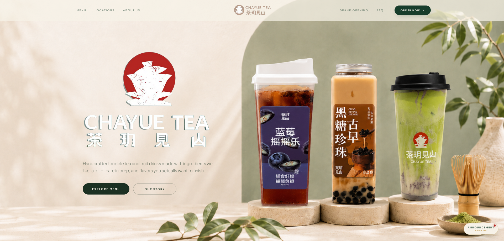

<h1 align="center">Hey, I'm Hieu 👋</h1>

Software Engineering Student · Web Developer · Founder of <strong>Yulin Studio</strong>

  
  
  

---

<h2>About Me</h2>

I'm <strong>Hieu Phan</strong>, a Software Engineering student at Windesheim University of Applied Sciences in the Netherlands.

I build modern websites/webshops with a strong focus on design, usability, and performance. What started as learning software development has grown into working on real projects for real businesses.

Alongside my studies, I founded <strong>Yulin Studio</strong>, where I design and develop websites and e-commerce experiences for businesses.

I mainly work with <strong>React, Next.js, TypeScript, and Tailwind CSS</strong>, while continuing to improve my full-stack and software engineering skills.

---

<h2>What I Do</h2>

<ul>
  <li>Build modern websites and web applications</li>
  <li>Design responsive and polished user interfaces</li>
  <li>Develop webshops and e-commerce experiences</li>
  <li>Work with businesses on real-world digital products</li>
  <li>Turn designs and ideas into production-ready websites</li>
  <li>Experiment with animation, interaction, and creative frontend development</li>
  <li>Continuously improve my full-stack and software engineering skills</li>
</ul>

---

<h2>Yulin Studio</h2>

I founded <strong>Yulin Studio</strong> to work directly with businesses and help them improve their online presence.

Through Yulin Studio, I work on websites, webshops, redesigns, landing pages, and custom frontend experiences. I handle projects from the initial idea and design all the way to development, deployment, integrations, and ongoing improvements.

Running Yulin Studio has also taught me a lot outside of programming, like communicating with clients, understanding business needs, managing projects, and designing solutions around real users instead of just technical requirements.

<strong>→ <a href="https://yulinstudio.com/">Visit Yulin Studio</a></strong>

---

<h2>Featured Client Work</h2>

<h3>Chayue Tea</h3>

A modern website built for <strong>Chayue Tea</strong>, designed to match the brand's visual identity while presenting its menu, locations, and overall experience in a clean and engaging way.

For this project, I worked on the design, development, responsive experience, communication, and ongoing improvements.

<strong>Work:</strong> Web Design · Frontend Development · Responsive UI 

<a href="https://www.chayuetea.nl/"><strong>View Live Website →</strong></a>

 

<strong>Want to see more of my work?</strong>
  
<a href="https://yulinstudio.com/"><strong>View more projects at Yulin Studio →</strong></a>

---

<h2>Tech Stack</h2>

<h3>Frontend</h3>

  
  
  
  
  
  

<h3>Backend & E-commerce</h3>

  
  
  

<h3>Design & Tools</h3>

  
  
  
  

---

<h2>Currently</h2>

<ul>
  <li>Studying Software Engineering at Windesheim</li>
  <li>Building websites and webshops through Yulin Studio</li>
  <li>Working on more advanced full-stack projects</li>
  <li>Improving my UI/UX and visual design skills</li>
  <li>Experimenting with animation and interactive web experiences</li>
  <li>Learning more about e-commerce and digital products</li>
</ul>

---

<h2>Beyond Code</h2>

When I'm not building websites, I'm usually training, working on new ideas, or learning something that can help me improve.

<ul>
  <li>🥊 I enjoy boxing and training</li>
  <li>💻 I like experimenting with new tech and building side projects</li>
  <li>🎨 I’m interested in design, branding, and creative digital experiences</li>
  <li>📈 I enjoy entrepreneurship and building things that can grow into real businesses</li>
  <li>🐶 I have a Maltese named Mochi</li>
  <li>✈️ I enjoy travelling and exploring new places</li>
</ul>

---

<h2>GitHub Stats</h2>

  

  

---

<h2>Let's Connect</h2>

I'm always interested in building new things, working with businesses, and connecting with other developers and creatives.

  <strong>🌐 <a href="https://yulinstudio.com/">Yulin Studio</a></strong>
   
  <strong>💼 <a href="https://linkedin.com/in/hyutech">LinkedIn</a></strong>
   
  <strong>✉️ <a href="mailto:hphan.tech@gmail.com">Email Me</a></strong>

